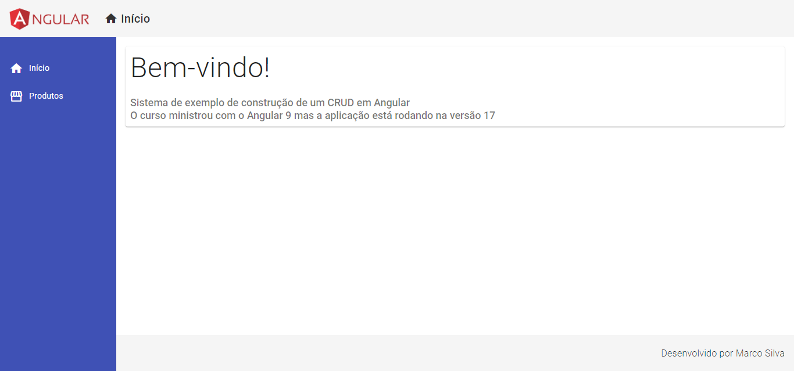
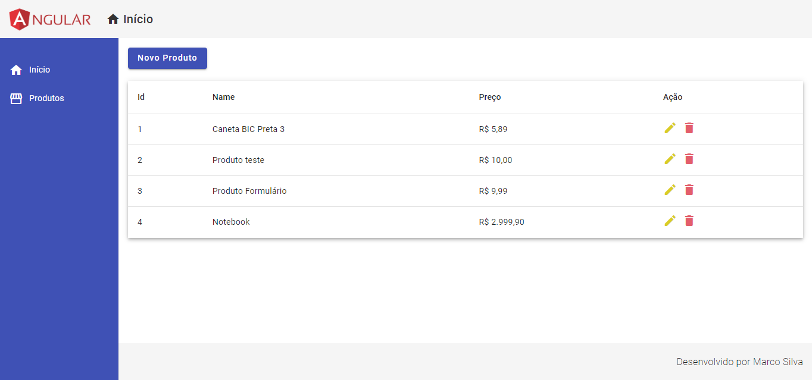
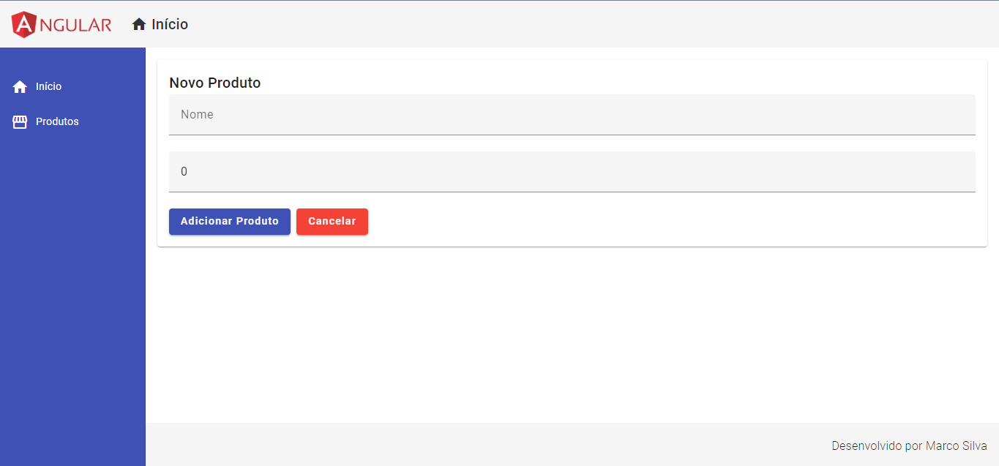
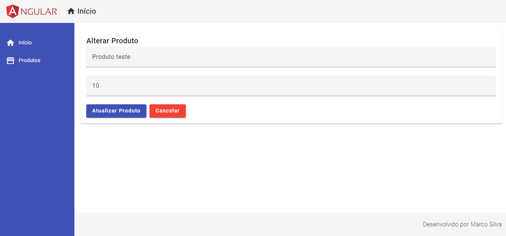
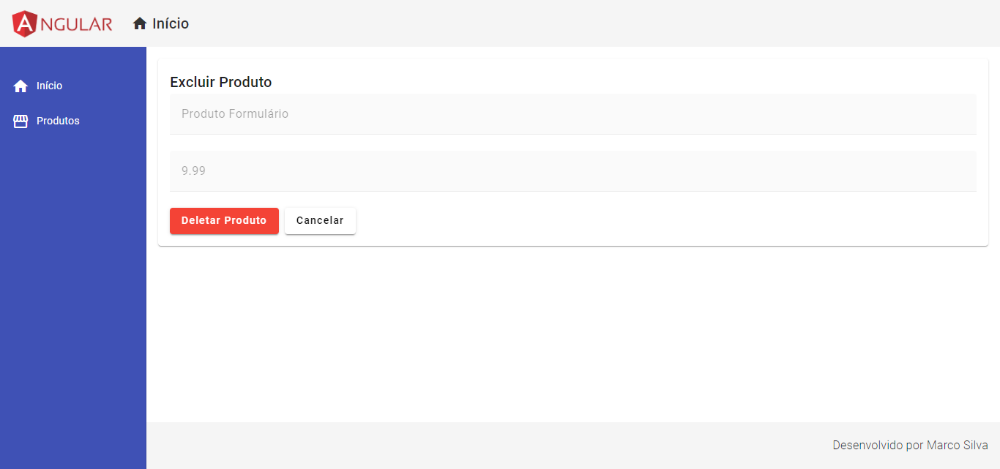

# App

This project was generated with [Angular CLI](https://github.com/angular/angular-cli) version 17.0.9.

## Development server
### First Run
1. Run `cd api && npm install && npm run start`.
2. Open new terminal and run `npm install && ng serve` for a dev server. Navigate to `http://localhost:4200/`.

### Second Run
1. Run `cd api && npm run start`.
2. Open new terminal and run `ng serve` for a dev server. Navigate to `http://localhost:4200/`.

# Pages
- Home

- Product List

- Add Product

- Edit Product

- Delete Product
